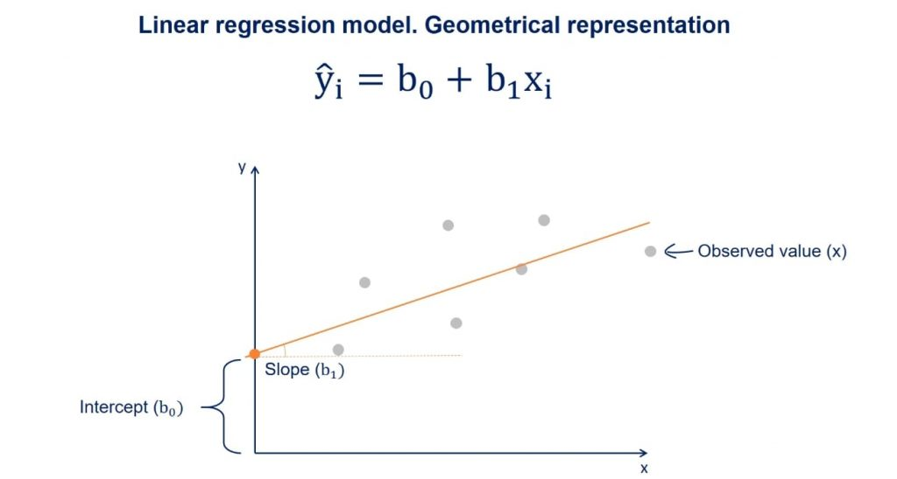

In this section we'll look at how to define and fit regression models in R.

### Load packages

```{r warning=FALSE, message=FALSE}
library(tidyverse)
library(caret)
```

## Part1: Linear Regression

We will perform a linear regression using daily cigarettes smoked and exercise level as predictors, $X$, and lived years as the outcome, $y$.

{fig-align="center"}

### Load data

In order to focus on the technical aspects we'll use a simple toy dataset. It contains the number of cigarettes smoked per day and how long the person lived. It is inspired by [this paper](https://www.ncbi.nlm.nih.gov/pmc/articles/PMC2598467/) if you want to take a look.

```{r, warning=FALSE, message=FALSE}
df_smoke <- read_csv('../data/smoking_cat.csv')
df_smoke
```

We have daily cigarettes smoked (number) and life (in years). Both of these are numeric variables. We also have a variable named exercise, it seems that this variable might in fact be an ordinal factor variable. Exercise is encoded as a numeric variable, so the first thing we will do is to convert it to a factor.

```{r}
df_smoke %>% 
  distinct(exercise)

df_smoke <- df_smoke %>% 
  mutate(exercise = as.factor(exercise))
```

### Split Data into Training and Test Set

Now, we will split our data into a test and a training set. There are numerous ways to do this. We here show `sample_frac` from `dplyr`:

```{r, warning=FALSE, message=FALSE}
# Set seed to ensure reproducibility
set.seed(123)  

# add an ID column to keep track of observations
df_smoke$ID <- 1:nrow(df_smoke)

train <- df_smoke %>% 
  sample_frac(0.70)

nrow(train)

head(train)
```

As you can see, the ID's in `train` are shuffled and it only has 75 rows since we asked for 75% of the data. Now all we have to do is identify the other 25%, i.e. the observations not in train.

```{r, warning=FALSE, message=FALSE}
#from df_smoke remove what is in train by checking the ID column
test  <- df_smoke %>% 
  filter(!ID %in% train$ID) 

# OR

test  <- anti_join(df_smoke, train, by = 'ID') 

nrow(test)
head(test)
```

### Defining the model

As stated above, a linear regression model generally has the form of:

$$y = β_0 + β_1 * x_i$$

Where we refer to $β_0$ as the intercept and $β_1$ as the coefficient. There will typically be one coefficient for each predictor. The goal of modelling is to estimate the values of $β_0$ and all $β_i$.

We need to tell R which of our variables is the outcome, $y$, and which predictors, $x_i$, we want to include in the model. This is referred to in documentation as the model's **formula**. Have a look:

```{r eval=FALSE}
#the formula is written like so:
lm(y ~ x1 + x2 + ..., data = myDataSet)
#see the help
?lm
```

In our case, $y$ is the number of years lived and we have a two predictors $x_1$ (numeric), the number of cigarettes smoked per day, and $x_2$ (ordinal factor), exercise level (0, 1 or 2). So that will be our model formulation:

```{r}
#remember to select the training data subset we defined above! 
model <- lm(life ~ daily_cigarettes + exercise, data = train)
```

### Modelling results

By calling `lm` we have already trained our model! The return of `lm()` is, just like the return of `prcomp()`, a named list.

```{r}
class(model)
names(model)
model
```

Let's have a look at the results. The summary gives us a lot of information about the model we trained:

```{r}
# View model summary
summary(model)
```

The **Residuals** section summarizes the distribution of the residuals, which is the difference between the actual observed $y$ values and the fitted $y$ values.

The **Coefficients** table shows the estimated values for each coefficient including the intercept, along with their standard errors, t-values, and p-values. These help to determine the significance of each predictor.

In the bottom section we have some information about how well the model fits the training data.

The **Residual Standard Error (RSE)** is the standard deviation of the residuals (prediction errors). It tells you, **on average, how far the observed values deviate from the regression line**.

The **R-squared** value indicates the proportion of variance explained by the model, with the Adjusted R-squared accounting for the number of predictors.

Finally, the **F-statistic** and its p-value tests whether the model as a whole explains a significant portion of the variance in the response variable (the outcome, $y$).

Lets plot the results and IMPORTANTLY check if model assumptions are upheld:

```{r}
par(mfrow=c(2,2))
plot(model)
```

### Model interpretation

Now, lets predict the life-expectancy for the individuals in our training data based on our fitted model. For this we will use the `predict()` function:

```{r, eval=FALSE, echo=FALSE}
train$predicted_life <- predict(model, newdata = train)
```

Plot to understand the model

```{r, eval=FALSE, echo=FALSE}
ggplot(train) + 
  geom_point(aes(x = daily_cigarettes, 
                 y = life, 
                 color = exercise)) + 
  geom_line(aes(x = daily_cigarettes, 
                 y = predicted_life, 
                 color = exercise)) + 
  labs(title = "Predicted Life by Smoking & Exercise", 
       x = "Daily cigarettes", 
       y = "Life", 
       color = "Exercise") + 
  theme_bw()
```

What do these results mean? Our model formulation is:

$$life = β_0 + β_1 * cigarettes + β_2 * exercise$$

And we estimated these values:

```{r}
model$coefficients
```

Therefore:

-   The intercept $β_0$ is the number of years we estimated a person in this dataset will live if they smoke 0 cigarettes and do not exercise. It is 77.6 years.

-   The coefficient of cigarettes per day is -0.29. This means for every 1 unit increase in cigarettes (one additional cigarette per day) the life expectancy decreases by 0.29 years. Similarly for the exercise variable, if you exercise your life expectancy will go up 1.1-2.4 years compared to no exercise, independently of how many cigarettes you smoke.

### Model performance

We now use our held out test data to evaluate the model performance. For that we will predict life expectancy for the 25 observations in `test` and compare with the observed values.

```{r}
#use the fitted model to make predictions for the test data
y_pred <- predict(model, newdata = test)
```

Let's see how the predicted values fit with the observed values.

```{r}
pred <- tibble(pred = y_pred, 
               real = test$life)

ggplot(pred, 
       aes(x=real, y=pred)) +
  geom_point()
```

Not too bad! We usually calculate the root mean square error (rmse) between predictions and the true observed values to numerically evaluate regression performance:

```{r}
RMSE(pred$real,pred$pred)
```

Our predictions are on average 0.87 years 'off'.

## Part2: Logistic Regression

Classification is the method we use when the outcome variable we are interested in is not continuous, but instead consists of two or more classes.

In order to have a categorical outcome, we'll add a column to our toy data that describes whether the person died before age 75 or not.

```{r}
df_smoke <- df_smoke %>%
  mutate(early_death = factor(ifelse(life < 75, 1, 0))) # Encoding: True/yes = 1, False/no = 0

df_smoke %>%
  count(early_death)
```

### Training and Test set with class data

Let's remake our training and test data. This time we have classes that we would like to be in the same ratios in training and test set. We must check this is the case!

```{r}
# Set seed to ensure reproducibility
set.seed(100)  

#add an ID column to keep track of observations
df_smoke$ID <- 1:nrow(df_smoke)

train <- df_smoke %>% 
  sample_frac(0.70)

table(train$early_death)


test  <- anti_join(df_smoke, train, by = 'ID') 

table(test$early_death)

```

Luckily for us the division of the outcome variable classes between the train and test set is almost perfect. However, there may be cases where randomly splitting will not give you a balanced distribution. This is likely to happen if one class is much larger than the other(s). In these cases you should split your data in a non-random way, specifically ensuring a balanced train and test set.

Now let's perform logistic regression to see whether there is an influence of the number of cigarettes and amount of exercise on the odds of the person dying before 75.

Logistic regression belongs to the family of generalized linear models. They all look like this:

$$ y \sim \beta * X $$

with:

-   $y$ the outcome
-   $\beta$ the coefficient matrix
-   $X$ the matrix of predictors
-   $\sim$ the link function

In a logistic regression model the link function is the logit. In a linear model the link function is the identity function (so \~ becomes =).

### Logistic regression: Math

In order to understand what that means we'll need a tiny bit of math.

Our $y$ is either 0 or 1. However we cannot model that, so instead we will model the probability of the outcome being 1: $P(earlydeath == 1)$. This means that all $y's$ have to be between these two values and how are we gonna enforce that? We wont.

Instead, we will model the log-odds of early death:

$$ y = \log(\frac{P(earlydeath == 1)}{1-P(earlydeath == 1)})$$

It may not look like it but we promise you this $y$ is a well behaved number because it can be anywhere between - infinity and + infinity. So therefore our actual model is:

$$ y \sim \beta * X$$

$$ \log(\frac{P(earlydeath == 1)}{1-P(earlydeath == 1)} = \beta * X$$

And if we want to know what this means for the probability of dying early, we just take and invert the link function:

$$ P(earlydeath == 1) = \frac{e^{(\beta * X)}}{1+ e^{(\beta * X)}} $$

Which can be shortened to:

$$ P(earlydeath == 1) = \frac{1}{1+ e^{(-y)}} $$

Which serves as the `link` between what we're actually interested in (the probability of a person dying early) and what we're modelling using logit. End of math.

### Model formulation in R

So in order to fit a logistic regression we will use the function for generalized linear models, `glm`. We will specify that we want logistic regression (using the logit as the link) by setting `family = binomial`:

```{r}
model_log <- glm(early_death ~ daily_cigarettes + exercise, data = train, family = "binomial")

summary(model_log)
```

### Model interpretation

We see from looking at the summary that the coefficient of exercise level 1 and level 2 is not significant. This means that we are not confident that doing any level of exercise has a significant impact on the probability of dying before 75 compared to doing no exercise.

Are you surprised? Exercise level was significant when we modelled the number of years lived with linear regressions.

With the number of daily cigarettes predictor we have a high degree of certainty that it influences the probability of dying before 75 (in this dataset!), but what does a coefficient of 1.1 mean?

We know that:

$$ P(earlydeath == 1) = \frac{1}{1+ e^{(-y)}} $$

and (leaving out the exercise level since it's not significant):

$$ y = \beta_0 + \beta_1 * cigs $$

So how does $y$ change as $1.1 * cigs$ becomes larger? Let's agree that $y$ becomes larger. What does that mean for the probability of dying before 75? Is $e^{(-y)}$ a large number if $y$ is large? Luckily we have a calculator handy:

```{r}
#exp(b) is e^b in R

exp(-1)

exp(-10)

exp(-100)
```

We see that $e^{(-y)}$ becomes increasingly smaller with larger $y$ which means that:

$$ P(earlydeath == 1) = \frac{1}{1+ small} \sim \frac{1}{1} $$

So the larger $y$ the smaller $e^{(-y)}$ and the closer we get to $P(earlydeath == 1)$ being 1. That was a lot of math for: If the coefficient is positive you increase the likelihood of getting the outcome, i.e. dying before 75.

### Model comparison

Now we know how to fit linear models and interpret the results. But often there are several predictors we could include or not include, so how do we know that one model is better than another?

There are several ways to compare models.

One is the likelihood ratio test which tests whether adding predictors significantly improves model fit by comparing the log-likelihoods of the two models.

Another very used way of comparing models is to look at the AIC (Akaike Information Criterion) or BIC (Bayesian Information Criterion). Lower AIC/BIC values generally indicate a better trade-off between model fit and complexity.

For example we made this logistic regression model above:

```{r}
summary(model_log)
```

But `exercise1` does not have a significant p-value. Perhaps we would have a better model if we only use `dialy_cigarettes`?

Let's compare them:

```{r}
model_reduced <- glm(early_death ~ daily_cigarettes, data = train, family = "binomial")
summary(model_reduced)
```

We can use an anova with the Chi-square (kai-square) test to compare the log-likelihood of the two models. It is most common to compare the less complex model to the more complex model:

```{r}
anova(model_reduced, model_log, test = 'Chisq')
```

The p-value of the Chi-square test tells us that there is evidence that the difference in log-likelihoods is significant. If it is not significant we would choose the less complex model with fewer predictors since that gives us more statistical power and less overfitting.

In our case the p-value is significant indicating that the model with exercise might in fact be better even if Exercise level 1 was not significant in the model.

### Model Evaluation

Lastly, let's evaluate our model using the test set, just like we did for the linear regression. First, we will predict the outcome for the test set:

```{r}
y_pred <- predict(model_log, newdata = test, type = 'response')

y_pred 
```

As you see, the predictions we get out are not $yes$ or $no$, they are instead a probability (as discussed above), so, we will convert them to class labels.

```{r}
y_pred <- ifelse(as.numeric(y_pred) >= 0.5, 1, 0) %>% 
  as.factor()

y_pred
```

Now we will compare the predicted class with the observed class for the test set. You can do this in different ways, but here we will use the accuracy.

$$ Accuracy = \frac{(True Positives + True Negatives)}{(True Positives + True Negatives + False Positives + False Negatives)}$$

You can calculate the accuracy yourself, or you can use a function like `confusionMatrix()` from the package `caret` which also provides you with individual metrics like sensitivity (true positive rate, recall) and specificity (true negative rate).

```{r}
caret::confusionMatrix(y_pred, test$early_death)
```
