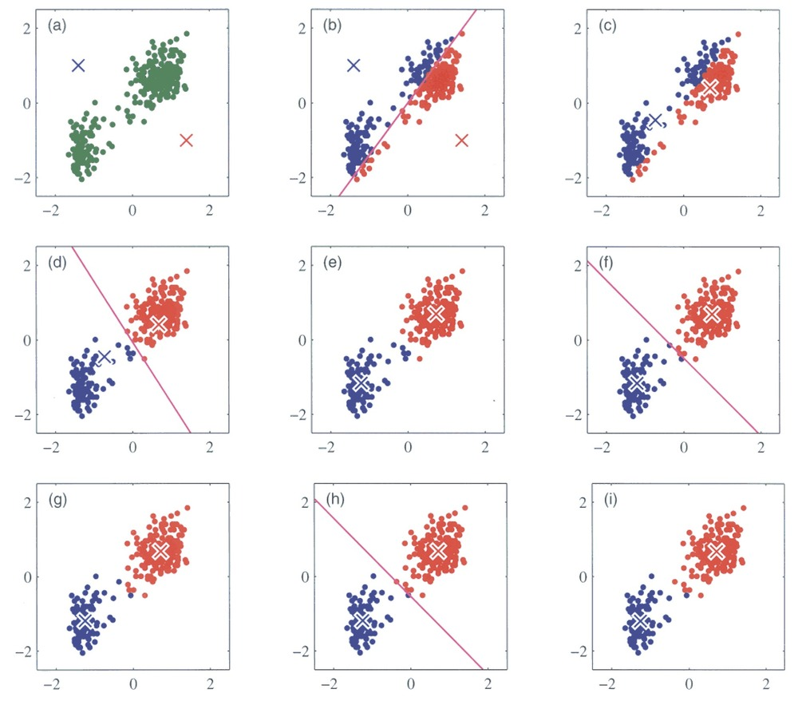
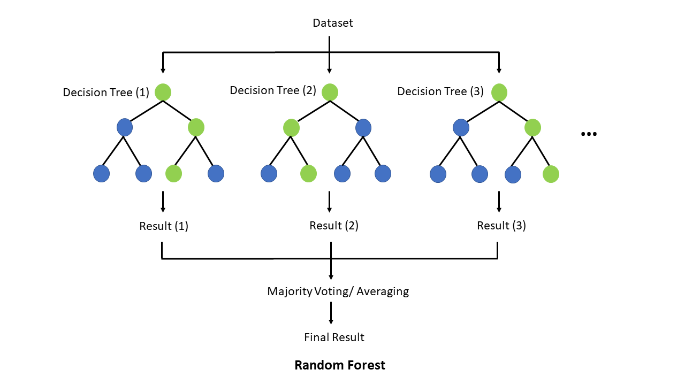

## Part 1: K-means Clustering

Clustering is a type of unsupervised learning technique used to group similar data points together based on their features. The goal is to find inherent patterns or structures within the data, e.g. to see whether the data points fall into distinct groups with distinct features or not.

### Wine dataset

For this we will use the wine data set as an example:

```{r warning=FALSE, message=FALSE}
library(tidyverse)
library(ggplot2)
library(ContaminatedMixt)
library(factoextra)
```

Let's load in the dataset

```{r}
data('wine') #load dataset
df_wine <- wine %>% as_tibble() #convert to tibble
df_wine
```

This dataset contains 178 wine, each corresponding to one of three different cultivars of wine. It has 13 numerical columns that record different features of the wine.

We will try out a popular method, k-means clustering. It works by initializing K centroids and assigning each data point to the nearest centroid. The algorithm then recalculates the centroids as the mean of the points in each cluster, repeating the process until the clusters stabilize. You can see an illustration of the process below. Its weakness is that we need to define the number of centroids, i.e. clusters, beforehand.

{fig-align="center"}

### Running k-means

For k-means it is very important that the data is numeric and scaled so we will do that before running the algorithm.

```{r}
# Set seed to ensure reproducibility
set.seed(123)  

# Pull numeric variables and scale these
kmeans_df <- df_wine %>%
  dplyr::select(where(is.numeric)) %>%
  mutate(across(everything(), scale))

kmeans_df

```

K-means clustering in R is easy, we simply run the `kmeans()` function:

```{r}
set.seed(123)  

kmeans_res <- kmeans_df %>%
  kmeans(centers = 4, nstart = 25)

kmeans_res

```

We can call `kmeans_res$centers` to inspect the values of the centroids. For example the center of cluster 1 is placed at the coordinates -0.79 for Alcohol, 0.04 for Malic Acid, 0.22 for Ash and so on. Since our data has 13 dimensions, i.e. features, the cluster centers also do.

This is not super practical if we would like to visually inspect the clustering since we cannot plot in 13 dimensions. How could we solve this?

### Visualizing k-means results

We would like to see where our wine bottles and their clusters lie in a low-dimensional space. This can easily be done using the `fviz_cluster()`

```{r}
fviz_cluster(object = kmeans_res, 
             data = kmeans_df,
             palette = c("#2E9FDF", "#00AFBB", "#E7B800", "orchid3"), 
             geom = "point",
             ellipse.type = "norm", 
             ggtheme = theme_bw())
```

### Optimal number of clusters

There are several ways to investigate the ideal number of clusters and `fviz_nbclust` from the `factoextra` package provides three of them:

The so-called elbow method observes how the sum of squared errors (sse) changes as we vary the number of clusters. This is also sometimes referred to as "within sum of square" (wss).

```{r}
kmeans_df %>%
  fviz_nbclust(kmeans, method = "wss")
```

The gap statistic compares the within-cluster variation (how compact the clusters are) for different values of K to the expected variation under a null reference distribution (i.e., random clustering).

```{r}
kmeans_df %>%
  fviz_nbclust(kmeans, method = "gap_stat")
```

Both of these tell us that there should be three clusters and we also know that there are three cultivars of wine in the dataset. Let's redo k-means with three centroids.

```{r}
# Set seed to ensure reproducibility
set.seed(123)  

#run kmeans
kmeans_res <- kmeans_df %>%
  kmeans(centers = 3, nstart = 25)
```

```{r}
#add updated cluster info to the dataframe
fviz_cluster(kmeans_res, data = kmeans_df,
             palette = c("#2E9FDF", "#00AFBB", "#E7B800"), 
             geom = "point",
             ellipse.type = "norm", 
             ggtheme = theme_bw())
```

Now, some obvious questions to ask might be (I) how do the clusters relate to the three cultivars of wine in the dataset? and (II) which variables are mainly driving the clustering?

Question (I) can be can be answered somewhat easily simply by coloring the clusters according to wine label or adding the label to the points in the plot above.

```{r}
fzPlot <- fviz_cluster(kmeans_res, data = kmeans_df,
             palette = c("#2E9FDF", "#00AFBB", "#E7B800"), 
             geom = "point",
             ellipse.type = "norm", 
             ggtheme = theme_bw())


wine_labs <- transform(fzPlot$data,
                       my_label = df_wine$Type)

fzPlot + geom_text(data = wine_labs,
  aes(label = my_label), size = 2.5)
```

The answer to question (II) is a bit more tricky. One way to get a sense of which variables may be contributing to the clustering is to examine the variance of the cluster centers across variables. A higher variance suggests that the cluster centroids differ more on that variable, so that variable may be playing a larger role in separating the clusters.

**Note:** This is only a descriptive heuristic, not a statistical test. Unlike PCA, k-means does not produce loadings, so there is no direct measure of variable importance in the same sense.

```{r}
var_importance <- apply(kmeans_res$centers, 2, var)
sort(var_importance, decreasing = TRUE)
```

## Part 2: Random Forest

In this section, we will train a **Random Forest (RF)** model. **Random Forest** is a simple ensemble machine learning method that builds multiple decision trees and combines their predictions to improve accuracy and robustness. By averaging the results of many trees, it reduces overfitting and increases generalization, making it particularly effective for complex, **non-linear** relationships. One of its key strengths is its ability to handle large datasets with many features, while also providing insights into feature importance.

{fig-align="center"}

Why do we want to try a **RF**? Unlike linear, logistic, or elastic net regression (presentation 5C - only if time permits), RF does not require predictors (or model residuals) to be normally distributed, nor does RF assume a linear relationship between predictors and the outcome — it can naturally capture non-linear patterns and complex interactions between variables.

Another advantage is that RF considers one predictor at a time when splitting at a predictor, making it robust to differences in variable scales and allowing it to handle categorical variables directly.

The downside to a is RF model is that it typically require a reasonably large sample size to perform well and can be less interpretable compared to regression-based approaches.

First and foremost, lets load the R packages needed for analysis:

```{r, warning=FALSE, message=FALSE}
library(tidyverse)
library(caret)
library(randomForest)
```

For this exercise we will use a dataset from patients with Heart Disease. Information on the columns in the dataset can be found [here](https://www.kaggle.com/datasets/redwankarimsony/heart-disease-data).

```{r, warning=FALSE, message=FALSE}
HD <- read_csv("../data/HeartDisease.csv")

head(HD)
```

Let's convert some of the variables that are encoded as numeric datatypes but should be factors:

```{r}
facCols <- c("sex", 
             "chestPainType", 
             "fastingBP", 
             "restElecCardio", 
             "exerciseAngina", 
             "slopePeakExST", 
             "DefectType", 
             "heartDisease")

HD <- HD %>% 
  mutate(across(all_of(facCols), as.factor))


head(HD)
```

Next, let's do some summary statistics to have a look at the variables we have in our dataset. Firstly, the numeric columns. We can get a quick overview of variable distributions and ranges with some histograms.

```{r}
# Reshape data to long format for ggplot2
long_data <- HD %>% 
  dplyr::select(where(is.numeric)) %>%
  pivot_longer(cols = everything(), 
               names_to = "variable", 
               values_to = "value")

head(long_data)
```

```{r}
# Plot histograms for each numeric variable in one grid
ggplot(long_data, 
       aes(x = value)) +
  geom_histogram(binwidth = 0.5, fill = "#9395D3", color ='grey30') +
  facet_wrap(vars(variable), scales = "free") +
  theme_minimal()
```

Importantly, let's check the balance of the categorical/factor variables.

```{r}
HD %>%
  dplyr::select(where(is.factor)) %>%
  pivot_longer(everything(), names_to = "Variable", values_to = "Level") %>%
  dplyr::count(Variable, Level, name = "Count")

# OR

# cat_cols <- HD_EN %>% dplyr::select(where(is.factor)) %>% colnames()
# 
# for (col in cat_cols){
#   print(col)
#   print(table(HD_EN[[col]]))
# }
```

From our count table above we see that variables `DefectType`, `chestPainType`, `restElecCardio`, and `slopePeakExST` are unbalanced. Especially `DefectType` and `restElecCardio` are problematic with only 7 and 15 observations for one of the factor levels.

To avoid issues when modelling, we will filter out these observations and re-level the two variables.

```{r}
HD_RF <- HD %>% 
  filter(DefectType != "0", restElecCardio != "2") %>%
  mutate(DefectType = as.factor(as.character(DefectType)), 
         restElecCardio = as.factor(as.character(restElecCardio)))
head(HD_RF)
```

In addition to ensuring an at least somewhat balanced data set, RF requires the outcome variable to be a categorical type, meaning we must convert `heartDisease` from a binary (0 or 1) variables to a category variable.

```{r}
# Mutate outcome to category and add ID column for splitting
HD_RF <- HD_RF %>% 
  mutate(heartDisease = fct_recode(heartDisease, noHD = "0", yesHD = "1")) 

head(HD_RF$heartDisease)
```

### Train & Test Set

We split our dataset into train and test set, we will keep 70% of the data in the training set and take out 30% for the test set. Importantly, we must ensure that all levels of each categorical/factor variable are represented in both sets! There are different ways of doing this in R, but one very easy way to achieve a good split is with the `createDataPartition()` function from `caret`.

```{r}
# Set seed to ensure same split when code is re-run
set.seed(123)

#
idx <- createDataPartition(HD_RF$heartDisease, p = 0.7, list = FALSE)
train <- HD_RF[idx, ]
test  <- HD_RF[-idx, ]
```

```{r}
# Split on outcome variable

table(train$heartDisease)
table(test$heartDisease)
```

In our case, because we have a fairly balanced dataset, we are lucky and all levels of the outcome variable can be represented in both sets. If this was not the case, we might have had to remove some variables (or levels) altogether.

### Random Forest Model

Now let's set up a RF model with cross-validation - this way we do not overfit our model. The R-package `caret` has a very versatile function `trainControl()` which can be used with a range of re-sampling methods including bootstrapping, out-of-bag error, and leave-one-out cross-validation.

```{r}
set.seed(123)

# Set up cross-validation: 5-fold CV
RFcv <- trainControl(
  method = "cv",
  number = 5,
  classProbs = TRUE,
  summaryFunction = twoClassSummary,
  savePredictions = "final"
)

```

Now that we have set up parameters for cross validation in the `RFcv` object above, we can feed it to the `train()` function from the `caret` packages. We also specify the **training data**, the **name of the outcome variable**, and, importantly, that we want to perform random forest (`method = "rf"`) as the `train()` function can be used for different models.

```{r, warning=FALSE, message=FALSE}

set.seed(123)

rf_model <- train(
  x = train %>% dplyr::select(-heartDisease),
  y = train$heartDisease,
  method = "rf",
  trControl = RFcv,
  metric = "Accuracy",
  tuneLength = 5,
  importance = TRUE
)

print(rf_model)
```

Next, we can plot your model fit to see how many explanatory variables significantly contribute to our model.

```{r}
# Best parameters
rf_model$bestTune

# Plot performance
plot(rf_model)
```

As we see from the plot above, the model performs best with four variables randomly sampled as candidates at each split (`mtry = 4`). There are different `tuning parameters` in a random forest, these include; n_estimators (number of trees), max_features (features to try at splits), max_depth (tree depth), and min_samples_split (minimum number of samples required to split a node).

The `tuneLength` argument in the `train()` function specifies how many different values of the tuning parameters to try.

Next, we use the test set to evaluate our model performance. We will do this with the predict function, which will give us the predicted probabilities for each class.

```{r}
# Predict class probabilities
y_pred <- predict(rf_model, newdata = test, type = "prob")
y_pred
```

As the output of predict is a probability of belonging to a specific class, we will need to convert these probabilities to class labels (yesHD or noHD). This way we can compare a predicted label with the true label in the test set to evaluate our model performance.

```{r}
y_pred <- as.factor(ifelse(y_pred$yesHD > 0.5, "yesHD", "noHD"))

caret::confusionMatrix(y_pred, test$heartDisease)
```

Lastly, we can extract the predictive variables with the greatest importance from your fit.

```{r}
varImpOut <- varImp(rf_model)

varImpOut$importance
```

```{r}
# Order by importance
varImportance <- as.data.frame(as.matrix(varImpOut$importance)) %>% 
  rownames_to_column(var = 'VarName') %>%
  arrange(desc(yesHD))

varImportance
```

Variable importance is based on how much each variable improves the model's accuracy across splits. Variables `nMajorVessels` and `DefectType` appear to be highlight predictive of heart disease.
